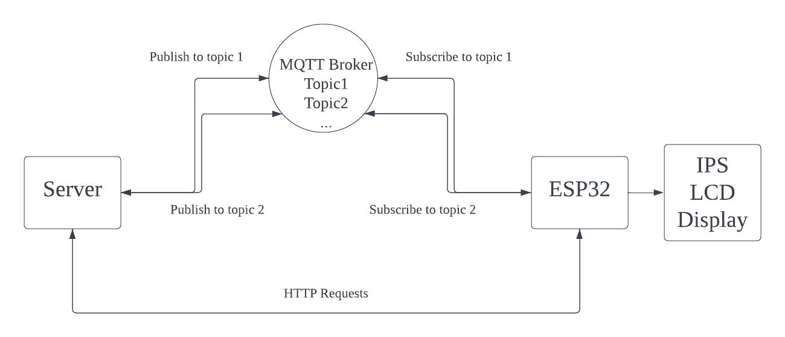

# Programming Project - Wireless PC Interaction Hub
Student Name: Runqiao Li<br />
Student ID: 100883273

This is a wireless PC interaction hub for better using experiences.<br />
Services provided:<br />
1. Monitoring CPU and memory usage in real-time
2. Tunning volume
3. Open a webpage as needed
## Motivation ##
This hub is created to provide a more convenient using experiences. It allows users to access some computer operations without opening or holding any windows under some particular conditions such as using borderless applications. 
Moreover, making this hub wireless using wifi connection provides flexibility to the hub for users to manage their space on the desk.

## Structure ##
<br /><br />

## How to Use ##
Make sure preparing a proper develop environment.<br />
1. Use esptool to install Micropython on ESP32 with command ```esptool.py --chip esp32 write_flash -z 0x1000 /path/to/your/firmware```
2. Use ampy to flash boot.py to ESP32 with command ```ampy --port COM3 put /path/to/your/program```, port number may be different from different computers.
3. Opene a new terminal, type command ```sudo systemctl start mosquitto``` to start broker locally.
4. Opene a new terminal, activate the virtual environment or system wisely, type command ```flask --app flaskr --debug run --host=0.0.0.0``` to start the server
5. Plug in the power source of the EPS32 development board

In the mqtt_client.py, MQTT broker IP addreess should be modified according to the network environment. The port is set by default, modify it if needed.<br />
In the program on ESP32, ssid and password should be modified according to the network environment.


## Dependencies ##
Several libraries are required for the server, command for installing libraries are provided below:<br />
| Library  | Version |
| ------------- | ------------- |
| paho-mqtt  | 1.6.1  |
| psutil  | 5.9.6  |
| pulsectl  | 23.5.2  |
| flask  | 3.0.0  |<br />
## IPS LCD Display Pin Connection ##
| Display Pins  | ESP32 Pins |
| ------------- | ------------- |
| VCC  | 3V3  |
| GND  | GND  |
| DIN  | D23  |
| CLK  | D18  |
| CS  | D5  |
| DC  | D14  |
| RST  | D27  |
| BL  | 3V3  |<br />

## Firmware ##
To run the program on ESP32, a required version of MicroPython supporting ST7789 Driver shall be flashed to the development board, provided by the link below: <br />
https://github.com/russhughes/st7789_mpy<br />
To flash the firmware, esptool should be installed. The related instruction can be found in the link below: <br />
https://docs.espressif.com/projects/esptool/en/latest/esp32/installation.html<br />
To flash the program, ampy should be installed. The related instruction can be found in the link below: <br />
https://github.com/scientifichackers/ampy<br />

## Future Enhancement ##
There is delay of the volume setting and it shall be improved in the future with other methods of communication.<br />
The server is currently running at local computer and open to all devices under the same network. It will be considered to be deployed on heroku or similar PaaS.
